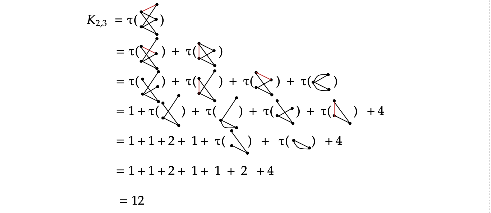

# Ch2

、

## 2*

> 一棵树T有 $ n_i $ 个 度数为 $ i $ 的顶点， $ i = 2,3, \dots , k$  , 其余顶点都是树叶，则T有几片树叶？

由图的性质有：
$$
2 \epsilon(T) = \sum_{i=1}^{k} in_i
$$
由树的性质有：
$$
\epsilon(T) = v(T)-1 =  \sum_{i=1}^{k} n_i -1
$$
上面两个式子联立可得：
$$
n_1 =  \sum_{i=2}^{k}(i-2)n_i +2
$$

## 4*

> 证明：如果T是树，且 $ \Delta(T) \geq n$，则T至少有n片树叶

由2.2题的结论我可以可以得到：
$$
n_1 =  \sum_{i=2}^{k}(i-2)n_i +2  \geq (\Delta(T)-2)*1 +2 = \Delta(T) \geq n
$$
得证

## 6*

> 证明：树有一个中心或两个中心，且有两个中心时，这两个中心相邻

### 方法一

可以使用删除叶子节点的方法，即证明删除$T$中所有叶子结点后，新树$T'$的中心不变。

对于  $\forall v \in V(T)$，如果要使$d(u,v)$最大，v显然是叶子。那么删除所有 $T$中叶子结点后，必然有：
$$
max_{\forall v \in V(T')}d(u,v) = max_{\forall v \in V(G)}d(u,v)-1
$$

所以u仍为$T'$的中心。

重复执行上述操作，最后只能得到$K_1，K_2$这两种情况，即一个顶点或者两个相邻顶点，得证。

### 方法二

可以用最长轨法证明最长轨的中点为树的中心。

## 11*

> 求 $K_{2,3}$生成树的个数

## 14

> 用Kruskal算法求图中边权图最小的生成树

Kruskal的算法是有限选择边权较小的边，选择的顺序是和Prim算法不一样的是，如下图所示，红色标记的是最小生成树，序号则是顺序。

